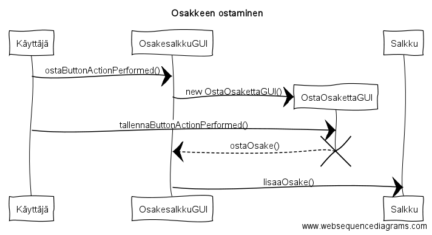

**Aihe:** Osakesalkku 

Toteutetaan järjestelmä, johon syötetään osakeostoja ja osakkeiden tietoja oston hetkellä, sekä lasketaan koko salkun arvo ja riskipitoisuus. Järjestelmässä on yksi osakesalkku, johon lisätään (käsin) osakkeita yksi kerrallaan. Lisäyksen aikana kerrotaan osakkeen arvo, osakkeiden määrä, volatiliteetti (esim. vuosittainen), beta-arvo (joka kertoo korrelaatiosta markkinan kanssa) ja valitaan osakkeen edustama toimiala. Järjestelmässä siis on valmis lista toimialoista, joista käyttäjä valitsee osakkeen toimialan.

Oletuksena on, että ainakin toistaiseksi kaikki osakkeet ovat Helsingin pörssistä (lähinnä markkinakorrelaation vuoksi) ja koska yksittäisten osakkeiden välistä korrelaatiota ei ilman suurta dataa saa selville, käytän toimialoja suuntaa-antavana informaationa. Järjestelmä siis käytännössä laskee ja näyttää salkun sisällön, arvon ja sen muutoksen, sekä riskipitoisuuden. Salkku osaa myös tottakai huomioida, jos jo omistettua osaketta ostetaan lisää tai myydään pois.

Ohjelma myös pystyy tallentamaan osakesalkun ja avaamaan tallennetun tiedoston. Tallentaminen toteutetaan .salkku-päätteiseen tekstiedostoon.

**Käyttäjät:** Salkunhoitaja

**Salkunhoitajan toiminnot:**
* salkun tarkastelu
* osakkeiden lisäys/poisto
* osakkeiden tietojen muokkaaminen
* salkun riskin tarkastelu
* salkun tallentaminen/avaaminen

